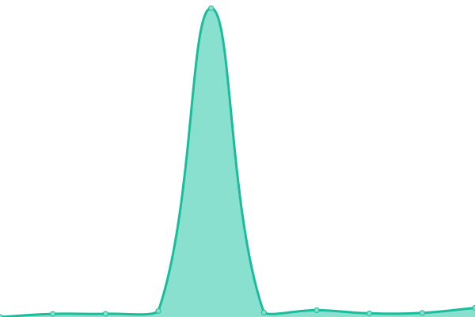
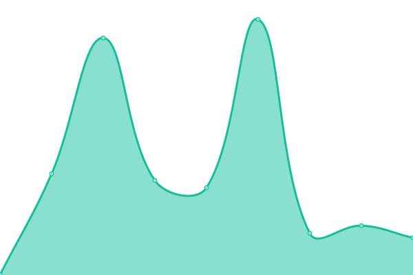
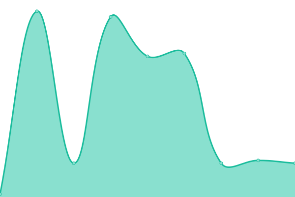

# [📈 Live Status](https://upptime.priv8.network): <!--live status--> **🟩 All systems operational**

This repository contains the open-source uptime monitor and status page for [Hylon Heaton](https://4heaton.com), powered by [Upptime](https://github.com/upptime/upptime).

With [Upptime](https://upptime.js.org), you can get your own unlimited and free uptime monitor and status page, powered entirely by a GitHub repository. We use [Issues](https://github.com/4heaton/priv8-upptime/issues) as incident reports, [Actions](https://github.com/4heaton/priv8-upptime/actions) as uptime monitors, and [Pages](https://upptime.priv8.network) for the status page.

<!--start: status pages-->
<!-- This summary is generated by Upptime (https://github.com/upptime/upptime) -->
<!-- Do not edit this manually, your changes will be overwritten -->
<!-- prettier-ignore -->
| URL | Status | History | Response Time | Uptime |
| --- | ------ | ------- | ------------- | ------ |
|  [SoVoCal](https://sovocal.org) | 🟩 Up | [so-vo-cal.yml](https://github.com/4heaton/priv8-upptime/commits/HEAD/history/so-vo-cal.yml) | 

 818ms
     
 | 

<a href="https://upptime.priv8.network/history/so-vo-cal">98.88%</a>
    

|  [Posh ACME](https://poshac.me) | 🟩 Up | [posh-acme.yml](https://github.com/4heaton/priv8-upptime/commits/HEAD/history/posh-acme.yml) | 

 235ms
     
 | 

<a href="https://upptime.priv8.network/history/posh-acme">98.88%</a>
    

|  [4Heaton](https://4heaton.com) | 🟩 Up | [4-heaton.yml](https://github.com/4heaton/priv8-upptime/commits/HEAD/history/4-heaton.yml) | 

 1286ms
     
 | 

<a href="https://upptime.priv8.network/history/4-heaton">98.88%</a>
    

|  [External DNS](47.181.77.90) | 🟩 Up | [external-dns.yml](https://github.com/4heaton/priv8-upptime/commits/HEAD/history/external-dns.yml) | 

 12ms
     
 | 

<a href="https://upptime.priv8.network/history/external-dns">100.00%</a>
    

<!--end: status pages-->

[**Visit our status website →**](https://upptime.priv8.network)

## 📄 License

- Powered by: [Upptime](https://github.com/upptime/upptime)
- Code: [MIT](./LICENSE) © [Hylon Heaton](https://4heaton.com)
- Data in the `./history` directory: [Open Database License](https://opendatacommons.org/licenses/odbl/1-0/)
